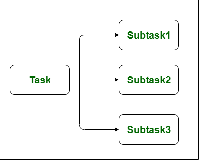

## Concurrency

```
Misalkan ada seorang karyawan diberikan 3 (tiga) tugas pada saat yang bersamaan. Karyawan tersebut bebas memilih untuk mengerjakan tugas yang mana terlebih dahulu. Dia bisa mengerjakan sebagian tugas 1 terlebih dahulu kemudian mengerjakan tugas lainnya. Atau dia juga bisa mengerjakan ketiga tugas tersebut satu per satu.

Dari sini maksudnya adalah concurrency berurusan dengan banyak tugas pada waktu yang sama tetapi tidak harus dikerjakan secara bersamaan.
```

## Parallel
```
Perbedaan parallel dan concurrency adalah parallel menjalankan tugas-tugasnya secara bersamaan.
```

```
Jika memakai contoh tadi, berarti tiga tugas tersebut diberikan kepada tiga karyawan sehingga ketiga tugas tersebut dapat dikerjakan secara bersamaan.
```

## Conclusion
```
Concurrency adalah tentang berurusan dengan banyak hal sekaligus. Sedangkan paralelisme adalah tentang melakukan banyak hal sekaligus.
```
