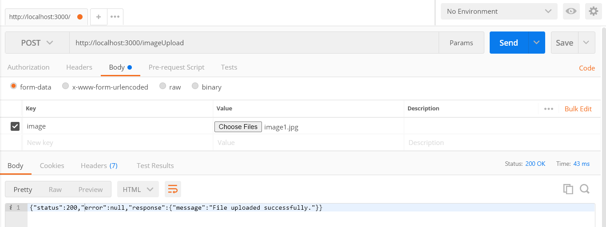

## Setup
```
npm install express
npm install bodyParser
npm install multer
```

## Run server using command :

```
node index.js
```
___
## Get Image
### Get your image through this link
```
http://localhost:3000/[filename]
```
### Example: 
```
http://localhost:3000/public/image1.png
```

___
## Upload Image
### upload your image to this link
```
http://localhost:3000/imageUpload
```
### Example: 



*note: make sure the key is image
