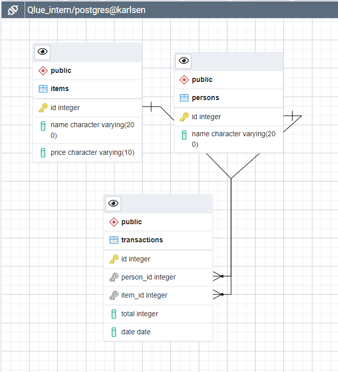

<h1>SQL</h1>

### I made a dummy database using postgresql with this schema

## Number 1

> SELECT p.name, sum(total) AS total_price  
FROM persons AS p NATURAL INNER JOIN transactions AS t  
GROUP BY p.name
___
## Number 2

> SELECT   
	SUM(t.total) AS Total,  
	date_part('month', t.date) AS "Month",  
	date_part('year', t.date) AS "Year"   
FROM transactions AS t  
GROUP BY "Month", "Year"  
ORDER BY "Year", "Month"

___
## Number 3

> SELECT p.name, COUNT(distinct t.item_id) AS "Total Variety"  
FROM transactions AS t, persons AS p  
WHERE t.person_id = p.id  
GROUP BY p.name  
ORDER BY "Total Variety" DESC
